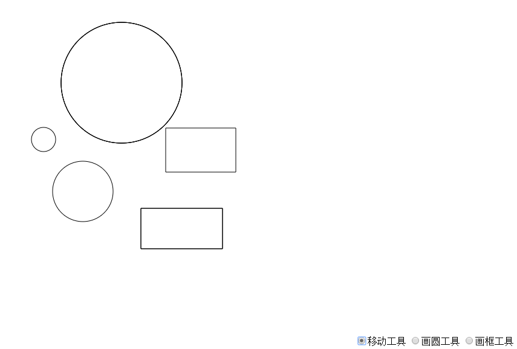

# gengineUI.js
A canvas UI library.

### DEMO
见`index.html`
或者https://garzon.github.io/gengineUI.js/

### 代码结构
- `gengineUI.js`: 包含`Manager`和`Util`类。`Manager`是用于处理`mouseMove`、`mouseUp`等事件，以及在每帧中负责把被`Manager.addObj()`添加到`Manager.objs`里的图形画到canvas的功能，`Util`包含一些向量运算的函数。
- `Basic*.js`：基本图形类。定义图形自身的的画法`draw()`的代码，以及判断鼠标是否落在图形内的函数`hitTest()`
- `*Tool.js`：负责实现每个工具的逻辑的代码。

即，整个代码库可分为`Manager`、`BasicShape`、`Tool`三个部分。

### 代码简介
对需要绘制的每帧，`Manager`会先清空图像，后调用`Manager.objs`里的每个图形对象的`draw()`方法来画出图形，因此，在处理拖拽等用户事件时，只需要直接修改每个图形对象中的位置、大小信息属性即可，而无需关心绘制的问题，即把绘制过程与用户事件解耦。
处理事件时，`Manager`会把必要的事件信息提取好，然后传到正在使用的工具`usingTool`的对应事件处理函数中，修改对应图形模型的信息。这个过程中用到了图形的碰撞检测`hitTest()`，即判断鼠标坐标是否落在图形内。
